# Online Dynamic Batching

[](https://github.com/online-dynamic-batching/online-dynamic-batching/actions/workflows/ci.yml)
[](https://pypi.org/project/online-dynamic-batching/)
[](pyproject.toml)
[](LICENSE)
[](https://arxiv.org/abs/2606.19989)

[](docs/integration-guides/pytorch-loop.md)
[](docs/integration-guides/hf-trainer.md)
[](docs/integration-guides/llamafactory.md)
[](docs/integration-guides/accelerate.md)
[](docs/integration-guides/lightning.md)

**Online dynamic batching for faster LLM/VLM fine-tuning.**

Online Dynamic Batching (ODB) forms token-budgeted batches after the real
training length is known: after templates, tokenization, truncation,
augmentation, and visual-token expansion. Short samples get larger batches,
long samples get smaller batches. ODB does not require model, optimizer, or
attention-kernel changes; your training stack remains responsible for
model-specific data processing.



## Why ODB

High-throughput LLM/VLM training needs batch construction to satisfy three
constraints at the same time:

| Requirement | Fixed-batch tension | ODB behavior |
| --- | --- | --- |
| Spatial efficiency | Mixing long and short samples creates padding waste. | Group samples after their real token lengths are visible. |
| Compute saturation | Small fixed batches reduce padding but can underfill each optimizer step. | Give short samples larger dynamic groups and long samples smaller groups under a token budget. |
| Time efficiency | Runtime templates, tokenization, augmentation, and visual-token expansion can leave the GPU waiting for the next batch. | Observe length, buffer samples, and form dynamic groups on the DataLoader-side asynchronous path. |

The core issue is observability: true training length is often known only after
the runtime input pipeline has produced model-ready tensors. Fixed-size batching
commits before seeing that length. Offline length caches can help, but they
require a separate pass and can go stale when templates, cutoffs, processors,
augmentation, or data mixtures change. ODB moves batch formation to the point
where true length is already observable, while leaving model code, optimizer
logic, and attention kernels unchanged.

## Get Started

Use ODB in three steps: install the package for your stack, pick one integration
path, then run either the small synthetic demo or a framework example.

### 1. Install ODB

Installing ODB has two parts:

- **ODB core:** dynamic grouping, DataLoader APIs, and step metadata.
- **Framework adapter:** optional trainer glue for Hugging Face Trainer,
  LLaMA-Factory, Accelerate, or Lightning.

The table below installs the right combination for your training stack. These
commands are alternatives, not sequential steps.

| If you use... | Run this command | Why |
| --- | --- | --- |
| Plain PyTorch loop | `pip install online-dynamic-batching` | Adds the core `ODBDataLoader(...)`, `odb.apply(...)`, and step metadata APIs. |
| Hugging Face Trainer or LLaMA-Factory | `pip install "online-dynamic-batching[hf]"` | Adds Trainer-compatible adapters and validation helpers. |
| Accelerate | `pip install "online-dynamic-batching[accelerate]"` | Adds Accelerate loop bridge helpers. |
| Lightning | `pip install "online-dynamic-batching[lightning]"` | Adds Lightning module and callback helpers. |

Each extra already includes the core package, so run only the command that
matches your training stack.

### 2. Choose One Integration Path

These are alternatives. Pick the row that matches your training stack.

| Stack | Guide | Recommended entry | Example project |
| --- | --- | --- | --- |
| Plain PyTorch loop | [PyTorch Loop](docs/integration-guides/pytorch-loop.md) | `ODBDataLoader(...)` or `odb.apply(...)` | [`examples/synthetic_benchmark.py`](examples/synthetic_benchmark.py) |
| Hugging Face Trainer | [HF Trainer](docs/integration-guides/hf-trainer.md) | `enable_odb(...)` | [`odb-example-hf-trainer`](https://github.com/online-dynamic-batching/odb-example-hf-trainer) |
| LLaMA-Factory | [LLaMA-Factory](docs/integration-guides/llamafactory.md) | `enable_odb(...)` for ODB-ready trainer hooks | [`odb-example-llamafactory`](https://github.com/online-dynamic-batching/odb-example-llamafactory) |
| Accelerate | [Accelerate](docs/integration-guides/accelerate.md) | `configure_accelerator(...)` | [`odb-example-accelerate`](https://github.com/online-dynamic-batching/odb-example-accelerate) |
| Lightning | [Lightning](docs/integration-guides/lightning.md) | `configure_lightning_module(...)` | [`odb-example-lightning`](https://github.com/online-dynamic-batching/odb-example-lightning) |

The shared MM-Mix dataset builder lives in
[`build-mm-mix-dataset`](https://github.com/online-dynamic-batching/build-mm-mix-dataset).

### 3. Run A Public Demo

The small demo lives in this repository. Clone it and install from source in
editable mode for the demo environment:

```bash
git clone https://github.com/online-dynamic-batching/online-dynamic-batching.git
cd online-dynamic-batching
python -m pip install -e .
python examples/synthetic_benchmark.py --device auto --num-samples 128
```

You can preview the notebook on GitHub:
[`examples/notebooks/odb_single_gpu_demo.ipynb`](examples/notebooks/odb_single_gpu_demo.ipynb).
To execute it, clone the repository and run the notebook in your local Jupyter
environment; no GitHub compute is required.

## Minimal PyTorch Loop

Use this path when you control DataLoader construction.

```python
import odb

dataloader = odb.ODBDataLoader(
    dataset,
    token_budget=16384,
    batch_size=1,          # ODB forms the real batch dynamically
    shuffle=True,
    num_workers=4,         # worker prefetching feeds the online buffer
    prefetch_factor=64,
    collate_fn=collate_fn,
    loss_scaling="exact",
    join=True,             # default DataLoader-side drain mode
)

for batch in dataloader:
    info = odb.pop_step_info(batch, loss_scaling="exact")

    loss = model(**batch).loss
    loss = loss * info.loss_scale
    loss.backward()
```

`info.all_samples_this_step` is the all-rank emitted sample count for the
current step. `info.loss_scale` is the current-rank multiplier for correct DDP
loss weighting when local dynamic batches differ across ranks.

## ODB-Ready Input Contract

ODB starts after your framework or model adapter has converted raw records into
single-sample tensors:

```text
raw data
  -> tokenizer / processor / template / multimodal adapter
  -> ODB-ready single-sample tensor dict
  -> ODB dynamic grouping
  -> trainer or training loop
```

The single-sample dict should contain `input_ids`, `attention_mask`, `labels`,
and any model-required multimodal tensors. ODB does not try to make different
model processors or chat templates produce identical tensors; it accelerates
the tensor stream your chosen training stack already defines.

## Core Concepts

- `ODBDataLoader(...)` and `odb.apply(dataloader, ...)` are the two DataLoader-side entry points.
- Framework adapters connect ODB metadata to Hugging Face Trainer,
  LLaMA-Factory-compatible trainers, Accelerate, and Lightning.
- `token_budget` is the target observed-token budget for each dynamic group.
- `join=True` is the default DataLoader-side drain mode for distributed
  training.
- `loss_scaling="exact"` is the recommended setting when DDP ranks may process
  different local sample/token counts.
- `ODBStepInfo` is the per-step metadata object consumed by trainer adapters or
  custom training loops.

For framework-specific entry points, see
[`docs/integration-guides/`](docs/integration-guides/README.md). For shared
runtime knobs and environment settings, see
[`docs/runtime-settings.md`](docs/runtime-settings.md).

## Benchmarks And Paper

Representative Qwen3-VL full fine-tuning results from the paper. The strongest
reported setting is the MM-Mix case study; the single-node rows show standard
public workloads. CV is the coefficient of variation of post-pipeline sequence
lengths.

| Workload | Setting | Length CV | Standard | ODB | Speedup |
| --- | --- | ---: | ---: | ---: | ---: |
| MM-Mix case study | 2-node 16xH20, 2B Full FT | 0.80 | 17.85 sam/s | 79.15 sam/s | **4.43x** |
| UltraChat 200K | 1-node 8xH20, 8B Full FT | 0.48 | 5.77 sam/s | 10.23 sam/s | 1.77x |
| LLaVA 150K | 1-node 8xH20, 8B Full FT | 0.29 | 14.38 sam/s | 24.87 sam/s | 1.73x |
| ShareGPT4o 57K | 1-node 8xH20, 8B Full FT | 1.00 | 2.37 sam/s | 5.83 sam/s | 2.46x |

ODB is described in
[**Online Dynamic Batching with Formal Guarantees for LLM Training**](https://arxiv.org/abs/2606.19989).
See [`docs/benchmarks.md`](docs/benchmarks.md) for benchmark reporting notes.

## Documentation Map

| Need | Start here |
| --- | --- |
| Run a small public demo | [`docs/quickstart.md`](docs/quickstart.md) |
| Integrate ODB into a framework | [`docs/integration-guides/`](docs/integration-guides/README.md) |
| Understand the grouping algorithm | [`docs/GROUPING_ALGORITHM.md`](docs/GROUPING_ALGORITHM.md) |
| Maintain API or adapter contracts | [`docs/API_DESIGN_NOTES.md`](docs/API_DESIGN_NOTES.md) |
| Tune runtime knobs and environment settings | [`docs/runtime-settings.md`](docs/runtime-settings.md) |
| Understand benchmark reporting | [`docs/benchmarks.md`](docs/benchmarks.md) |
| Check release and example validation scope | [`docs/validation.md`](docs/validation.md) |
| Let a coding agent patch a custom training stack | [`docs/agent-assisted-integration.md`](docs/agent-assisted-integration.md) |
| Read the paper | [`arXiv:2606.19989`](https://arxiv.org/abs/2606.19989) |

## Integration Checklist

- DataLoader emits one fully processed sample at a time: `batch_size=1`.
- DataLoader uses worker prefetching: `num_workers > 0`.
- ODB is applied after sampler/shuffle behavior is selected.
- Trainer removes ODB metadata before model forward.
- Trainer uses `info.loss_scale` when DDP ranks process different local
  sample/token counts.
- Distributed training pairs ODB's default `join=True` DataLoader-side drain
  with the framework's uneven-input guard when model collectives need it.
- Runtime/environment settings such as `group_order_flip`, ODB buffer-fill
  warm-up, and PyTorch multiprocessing sharing strategy are documented in
  [`docs/runtime-settings.md`](docs/runtime-settings.md).

## Project Layout

```text
src/odb/                     # core package
src/odb/integrations/        # trainer adapters
examples/                    # synthetic benchmark and notebook demo
docs/integration-guides/     # framework-specific guides
docs/benchmarks.md           # benchmark reporting policy
agent-skills/                # optional coding-agent integration helper
```

## Build And Verify

```bash
python -m pip install -e ".[dev]"
python -m pip install -U build twine
python -m build
python -m twine check dist/*
python -m pip install dist/online_dynamic_batching-*.whl
python -c "import odb; print(odb.__version__)"
python -m pytest
```

## Roadmap

ODB's roadmap is focused on runtime capabilities: stronger distributed-training
semantics, clearer trainer interfaces, additional batching policies, structured
observability, and reproducible benchmarking. See [`ROADMAP.md`](ROADMAP.md).

## Citation

If you find ODB useful, please cite:

```bibtex
@misc{li2026online,
  title         = {Online Dynamic Batching with Formal Guarantees for LLM Training},
  author        = {Dian Li and Zekun Wang and Yaoru Wang and Jiahong Yan},
  year          = {2026},
  eprint        = {2606.19989},
  archivePrefix = {arXiv},
  primaryClass  = {cs.DC},
  url           = {https://arxiv.org/abs/2606.19989}
}
```

## License

Apache-2.0
